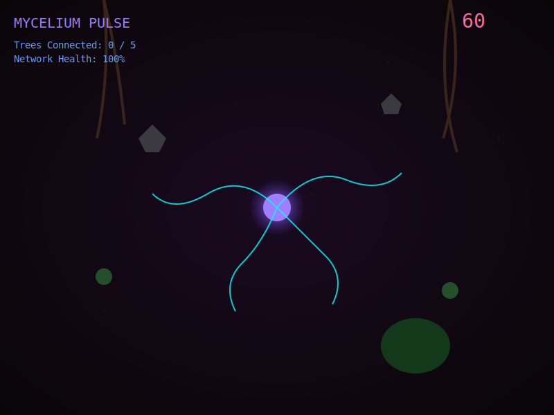

# Mycelium Pulse

An ancient fungal network stirs beneath the forest floor. You are the mycelium — a living web of bioluminescent tendrils reaching out to connect isolated trees before winter arrives.

Grow your glowing cyan and violet threads through dark earth, steering with your mouse. Link the forest's roots together to create a unified network strong enough to survive the coming cold.

## How to Play

**Objective:** Connect all 5 trees before the timer runs out.

**Controls:** Move your mouse to guide tendrils outward from the central spore. New tendrils spawn automatically over time.

**Obstacles:**
- 🪨 Rocks sever your network on contact
- ☠️ Toxic green patches kill tendrils instantly

**Win:** Connect all 5 trees before the 60-second timer expires.
**Lose:** Timer reaches zero before network is complete.

Click anywhere to start the game and enable audio.

## Built With
- [Three.js r183](https://threejs.org/)
- [Tone.js v15.1.22](https://tonejs.github.io/)

## Links
- **Play:** https://nishivector.github.io/mycelium-pulse/
- **Repo:** https://github.com/nishivector/mycelium-pulse
